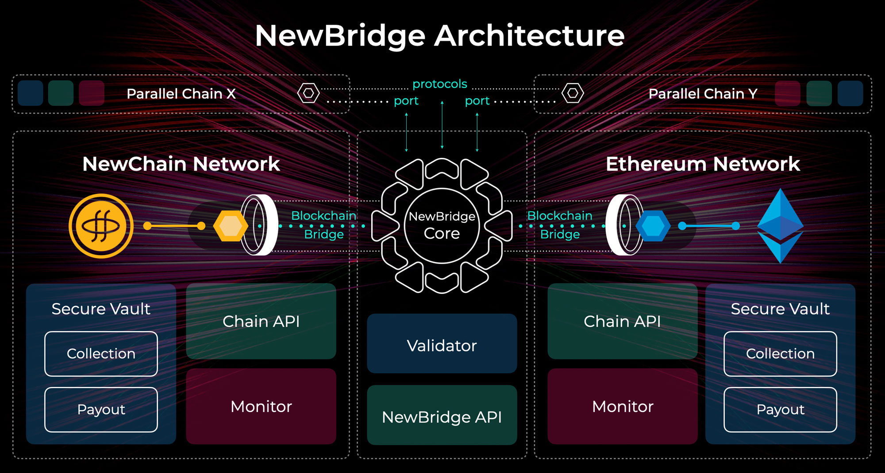

# NewBridge Architecture

NewBridge has multiple Components, here is a simplified list:

- NewBridge Core
  - Validator
- Secure Vault
  - Collection
  - Payout
- Monitor (Deposit)
- APIs
  - NewBridge Service API
  - XChain API

And a graph to the Architecture:

## Monitor

Each chain has its own `monitor` program, which will detect the payment status of the address in the system based on token information.

## Secure Vault

Secure Vault is a component to keep the assets safe and secure in each blockchain. And it is also functions as a service to collect the deposit from each blockchain, as well as payout the assets to another account in the blockchain validated by the NewBridge Core Validator component.

### Collection

Each chain has its own `collection` program

- native
  for native assets such as ETH or NEW, general transfer
- burnable
  for burnable token，use burn function to burn token
- transfer
  transfer token to system offline wallet

### Payout

Each chain has its own `payout` program

- native
  native coin user general transfer, from MainAddress to payout
- mintable
  for mintable token, call mint function by MainAddress
- transfer
  for token, call transfer function by MainAddress

## NewBridge Core (Validator)

NewBridge Core is used to coordinate the user deposit, handling fee, payout;

- Input
  - User deposit address
  - System receipt address
  - Amount
- Out
  - User receipt address
  - Amount
